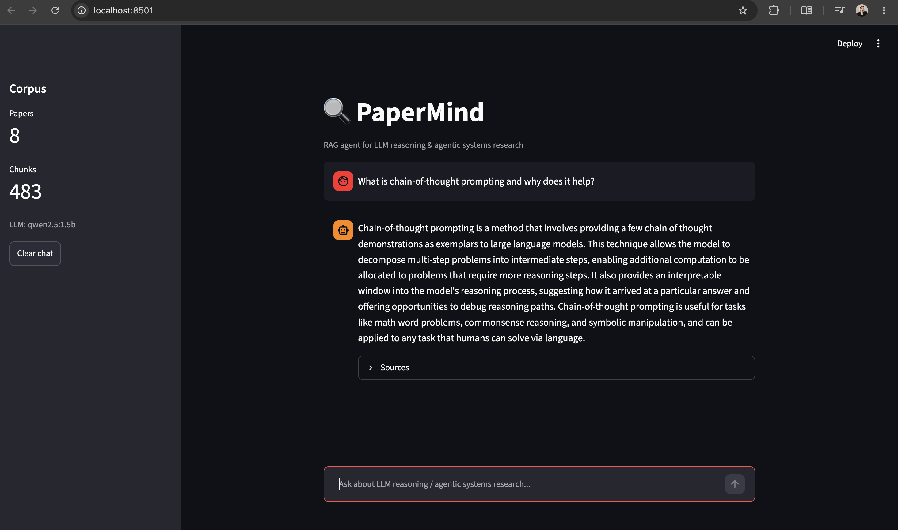
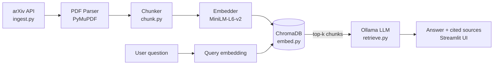

# 🔍 PaperMind: RAG Agent for LLM Reasoning & Agent Research




An AI research assistant that reads arXiv papers on LLM reasoning and agentic systems, and answers questions with cited sources. Built from scratch to understand how retrieval-augmented generation works under the hood. It runs fully locally: no API keys, no cloud costs.

## 💡 What is this?

Most "chat with your PDFs" demos are thin wrappers around an API call. This project builds the full pipeline manually (ingestion, parsing, chunking, embedding, vector search, and grounded generation) on a focused corpus of papers about chain-of-thought, tool use, and LLM agents.

The goal is twofold:

1. A working tool I actually use to study current ML research
2. A from-scratch demonstration of how RAG systems are engineered, not just consumed

## 🏗️ Architecture



**Indexing (offline):** `ingest.py` → `chunk.py` → `embed.py`
**Querying (online):** `main.py` / `retrieve.py` embed the question, pull the most similar chunks from ChromaDB, and ask the LLM to answer only from that context.

## 🚀 Features

| Feature | Status |
|---|---|
| arXiv ingestion with download retry/backoff | ✅ Done |
| PDF parsing & word-window chunking with overlap | ✅ Done |
| Local embeddings (sentence-transformers) | ✅ Done |
| Vector search (ChromaDB, persistent) | ✅ Done |
| Grounded generation with numbered source list | ✅ Done |
| Chat UI (Streamlit) | ✅ Done |
| Expandable corpus (custom arXiv queries, `add_pdf.py` for local PDFs) | ✅ Done |
| Configurable via `.env` | ✅ Done |
| Demo GIF / screenshots | 🔲 Planned |
| Retrieval quality evaluation | 🔲 Planned |

## 🛠️ Tech Stack

| Layer | Tool |
|---|---|
| Ingestion | arXiv API (`arxiv` package) |
| Parsing | PyMuPDF |
| Embeddings | sentence-transformers (`all-MiniLM-L6-v2`, local) |
| Vector DB | ChromaDB (persistent, local) |
| Generation | Ollama (default `qwen2.5:1.5b`, swappable) |
| UI | Streamlit |
| Language | Python 3.12 |

## 📁 Project Structure

| File | Purpose |
|---|---|
| `config.py` | Central settings, read from `.env` with sensible defaults |
| `ingest.py` | Search arXiv, download PDFs (with retry), save metadata |
| `add_pdf.py` | Add a PDF you already have to the corpus |
| `chunk.py` | Extract text and split into overlapping word windows |
| `embed.py` | Embed chunks and store them in ChromaDB |
| `retrieve.py` | Retrieve top-k chunks and generate a cited answer (also a CLI) |
| `main.py` | Streamlit chat interface |

## ⚙️ Setup

```bash
git clone https://github.com/AMINA-ELHASNAOUY/Retrieval-Augmented-Generation-.git
cd Retrieval-Augmented-Generation-
python3.12 -m venv venv
source venv/bin/activate
pip install -r requirements.txt
cp .env.example .env        # optional: tweak models, chunk size, etc.
```

Install [Ollama](https://ollama.com) and pull a model:

```bash
ollama pull qwen2.5:1.5b
```

## ▶️ Usage

**1. Build the corpus**

```bash
python ingest.py --max 12     # fetch papers from arXiv
python chunk.py               # split into overlapping chunks
python embed.py               # embed + store in ChromaDB
```

**2. Ask questions**

```bash
streamlit run main.py                                       # chat UI
python retrieve.py "What is chain-of-thought prompting?"    # CLI
```

**Custom arXiv query**

```bash
python ingest.py --max 12 --query '(cat:cs.CL OR cat:cs.AI) AND abs:"LLM agents"'
```

**Add a PDF you already have**

```bash
python add_pdf.py path/to/paper.pdf --id 2201.11903 --title "Paper title"
python chunk.py && python embed.py
```

**Use a larger model** (better cited answers, slower on a laptop)

```bash
ollama pull qwen2.5:7b
OLLAMA_MODEL=qwen2.5:7b streamlit run main.py
```

## 📚 Current Corpus

The working corpus has 8 papers on chain-of-thought, tool use, and LLM agents (483 chunks), including *Chain-of-Thought Prompting Elicits Reasoning in Large Language Models* (2201.11903) and *Efficient Tool Use with Chain-of-Abstraction Reasoning* (2401.17464). PDFs and the vector store are not committed; rebuild them with the commands above.

## ⚠️ Known Limitations

- The corpus is small, so answers are only as good as the papers ingested.
- arXiv search results can include off-topic papers; query wording matters.
- Some arXiv PDF downloads fail (404/406). `ingest.py` retries transient errors and skips permanent ones.
- Small local models can paraphrase loosely. Check the cited sources.

## 📍 Roadmap

- [x] Milestone 1: arXiv ingestion + PDF parsing
- [x] Milestone 2: Chunking + local embedding + ChromaDB storage
- [x] Milestone 3: Retrieval + LLM generation with source citations
- [x] Milestone 4: Streamlit chat interface
- [ ] Milestone 5: Polish (demo GIF, retrieval evaluation, larger corpus)

## 📄 License

MIT. See [LICENSE](LICENSE).
